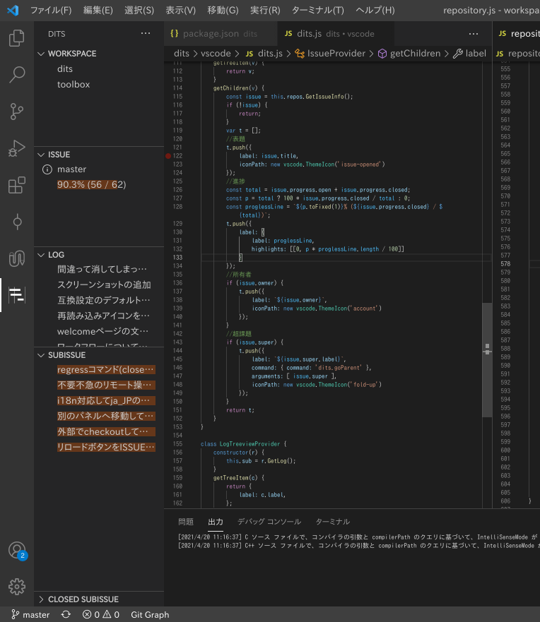

# dits

## これは何？

分散VCS(構成管理システム)を使って分散ITS(課題管理システム)を実現するツール。その名もdits。そのまんまですね。

## どうして...

動機はいくつかある。

* ITSをセットアップするのが面倒
* セットアップする手間がないGitHubとかBitBucketやらだと子チケットを作れない
* VCSとITSは一体であることが自然 
TiDDなポリシー下ではIssueのOpen/Closeとトピックブランチの生成/消滅は対応しているのだから。であるにも関わらずコミットメッセージに**手動で**チケット番号書いてたまに間違っても直せない「連携」って、**お前らそんなんで満足なのか？**

...というわけで、ブランチとissueが同期した分散ITSを作ることにしたが、UIをどうしようか悩んでいた時にVSCodeを使うことを思いついた。規格策定を兼ねてまずはそこからと進めたのがこれ。

## スクリーンショット

操作や表示はサイドバーに集約してある。

## 特長

1. 課題を無限に階層化できる 
WBSレベルからTODOレベルまでを統一的に扱える(予定：まだスケジューリング関連機能を実装していないので)。現在、そのようにWBSからTODOまでを統一的に扱えるITSはRedmineくらいしかない。
2. 軽快 
極力ローカルで完結するように設計されているので動作が軽快。
3. VCS(構成管理システム)と一体